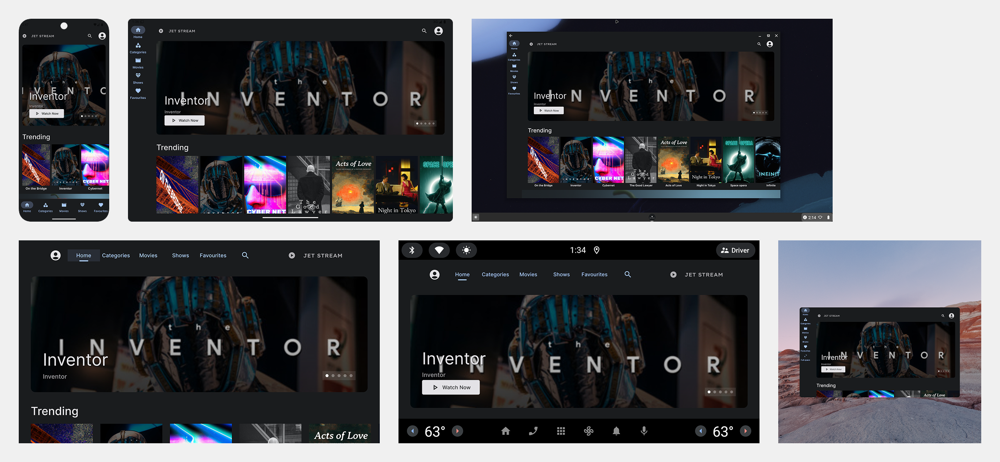

# **Adaptive Apps Samples: JetStream**

Jetstream is a sample media streaming application designed to adapt to various form factors using a single binary. It leverages Compose Material3  for cross-device compatibility, enabling [adaptive experiences](https://developer.android.com/adaptive-apps) across different form factors.

* Mobile device  
* Tablet  
* Foldable device  
* Chromebook  
* TV  
* Automotive  
* XR device



This directory contains a version of the JetStream TV sample app that utilizes [Compose Material3](https://developer.android.com/jetpack/androidx/releases/compose-material3) components, with some exceptions like the [featured carousel](https://developer.android.com/design/ui/tv/guides/components/featured-carousel). It builds upon the original JetStream sample to offer experiences tailored to different device form factors. The original JetStream app for TV can be found at [https://github.com/android/tv-samples/](https://github.com/android/tv-samples/).

## Requirements

* You need  Android Studio to try the sample app.   
* If you are trying JetStream on XR emulator,  refer to [this document](https://developer.android.com/develop/xr/jetpack-xr-sdk/setup) for the details.  
* You can clone this repository and build the sample app in AdaptiveJetStream directory.  Refer to [this document](https://developer.android.com/jetpack/compose/setup#sample) for the steps.

## Performance

The `benchmarks` module contains sample tests written using the [Macrobenchmark](https://developer.android.com/studio/profile/macrobenchmark) library. It also contains the test to generate the baseline profile for JetStream app.

### Baseline profiles

The baseline profile for this app is generated as `jetstream/src/release/generated/baselineProfiles/baseline-prof.txt`, which contains rules that enable AOT compilation of the critical user path taken during app launch. Refer to this [document](https://developer.android.com/studio/profile/baselineprofiles) to learn more about baseline profiles

## License

```  
Copyright 2025 Google LLC

Licensed under the Apache License, Version 2.0 (the "License");  
you may not use this file except in compliance with the License.  
You may obtain a copy of the License at

    https://www.apache.org/licenses/LICENSE-2.0

Unless required by applicable law or agreed to in writing, software  
distributed under the License is distributed on an "AS IS" BASIS,  
WITHOUT WARRANTIES OR CONDITIONS OF ANY KIND, either express or implied.  
See the License for the specific language governing permissions and  
limitations under the License.  
```

